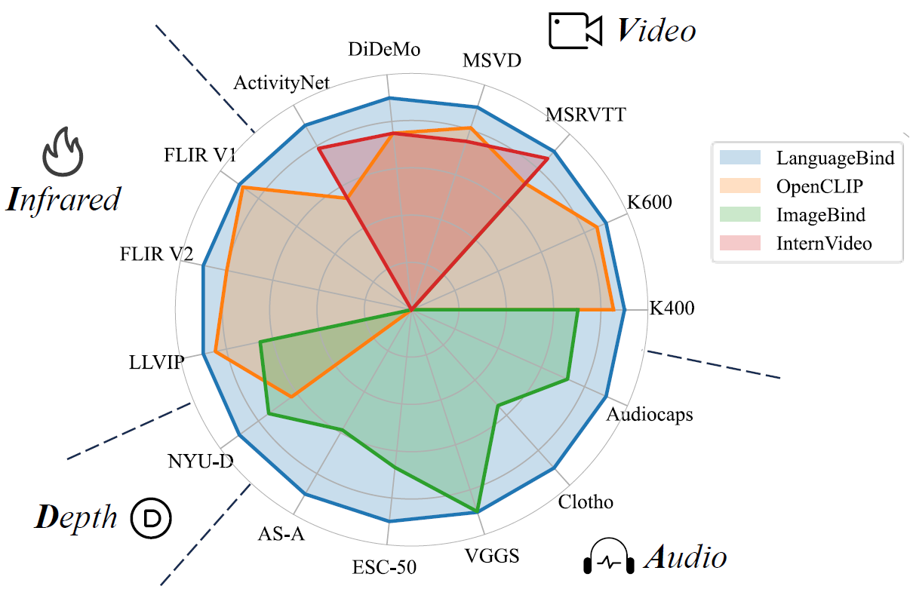
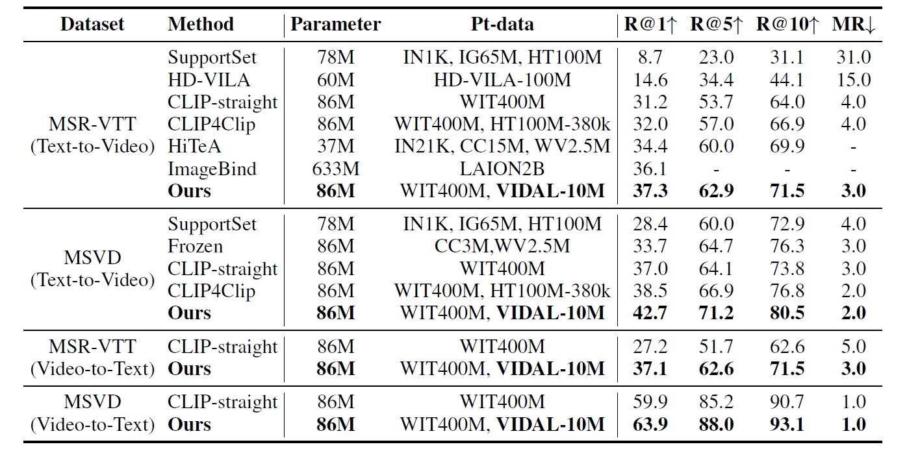
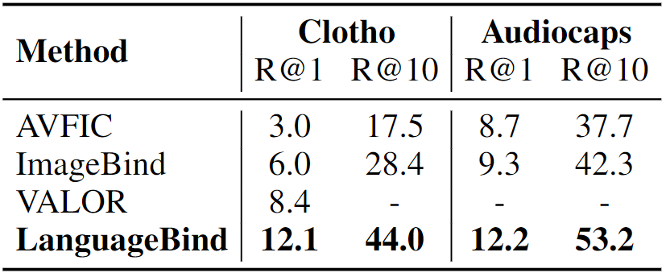
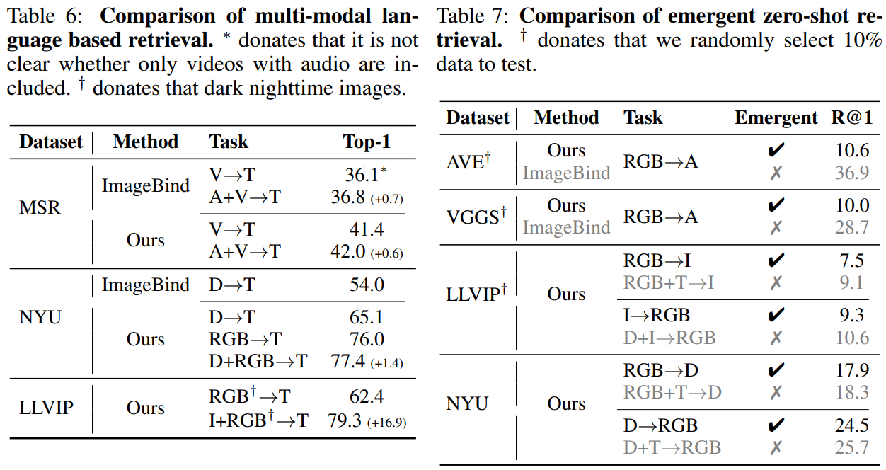

<p align="center">
    
<p>
<h2 align="center"> <a href="https://arxiv.org/pdf/2310.01852.pdf">【ICLR 2024 🔥】LanguageBind: Extending Video-Language Pretraining to N-modality by Language-based Semantic Alignment</a></h2>
<h5 align="center"> If you like our project, please give us a star ⭐ on GitHub for latest update.  </h2>

 
<h5 align="center">
     
[](https://huggingface.co/spaces/LanguageBind/LanguageBind)
[](https://huggingface.co/datasets/LanguageBind/VIDAL-Depth-Thermal) 
[](https://arxiv.org/abs/2310.01852)
[](https://mp.weixin.qq.com/s/EFqLv_Euf5VU024zOtzkkg)
[](https://mp.weixin.qq.com/s/E5Tazm_vz1CADMwV0tdhnw)
[](https://zhuanlan.zhihu.com/p/660567767)
[](https://github.com/PKU-YuanGroup/LanguageBind/blob/main/LICENSE)
[](https://github.com/PKU-YuanGroup/LanguageBind/blob/main/DATASET_LICENSE)
[](https://hits.seeyoufarm.com) 
[](https://github.com/PKU-YuanGroup/LanguageBind/issues?q=is%3Aopen+is%3Aissue)
[](https://github.com/PKU-YuanGroup/LanguageBind/issues?q=is%3Aissue+is%3Aclosed)  <br>

</h5>

[](https://paperswithcode.com/sota/zero-shot-audio-classification-on-audioset?p=languagebind-extending-video-language) <br>
[](https://paperswithcode.com/sota/zero-shot-audio-classification-on-vgg-sound?p=languagebind-extending-video-language) <br>
[](https://paperswithcode.com/sota/zero-shot-text-to-audio-retrieval-on-clotho?p=languagebind-extending-video-language) <br>
[](https://paperswithcode.com/sota/zero-shot-scene-classification-unified?p=languagebind-extending-video-language) <br>
[](https://paperswithcode.com/sota/zero-shot-classification-unified-classes-on?p=languagebind-extending-video-language) <br>
[](https://paperswithcode.com/sota/zero-shot-video-retrieval-on-msvd?p=languagebind-extending-video-language) <br>
[](https://paperswithcode.com/sota/zero-shot-environment-sound-classification-on-1?p=languagebind-extending-video-language) <br>
[](https://paperswithcode.com/sota/zero-shot-text-to-audio-retrieval-on?p=languagebind-extending-video-language) <br>
[](https://paperswithcode.com/sota/zero-shot-video-retrieval-on-activitynet?p=languagebind-extending-video-language) <br>
[](https://paperswithcode.com/sota/zero-shot-video-retrieval-on-msr-vtt?p=languagebind-extending-video-language) <br>
[](https://paperswithcode.com/sota/zero-shot-video-retrieval-on-didemo?p=languagebind-extending-video-language) <br>
[](https://paperswithcode.com/sota/zero-shot-action-recognition-on-kinetics?p=languagebind-extending-video-language) 

<details open><summary>💡 I also have other vision-language projects that may interest you ✨. </summary><p>
<!--  may -->

> [**Video-LLaVA: Learning United Visual Representation by Alignment Before Projection**](https://arxiv.org/abs/2311.10122) <br>
> Bin Lin, Yang Ye, Bin Zhu, Jiaxi Cui, Munan Ning, Peng Jin, Li Yuan <br>
[](https://github.com/PKU-YuanGroup/Video-LLaVA)  [](https://github.com/PKU-YuanGroup/Video-LLaVA) [](https://arxiv.org/abs/2311.10122) <br>

> [**MoE-LLaVA: Mixture of Experts for Large Vision-Language Models**](https://github.com/PKU-YuanGroup/MoE-LLaVA/blob/main/MoE-LLaVA.pdf) <br>
> Bin Lin, Zhenyu Tang, Yang Ye, Jiaxi Cui, Bin Zhu, Peng Jin, Junwu Zhang, Munan Ning, Li Yuan <br>
[](https://github.com/PKU-YuanGroup/MoE-LLaVA)  [](https://github.com/PKU-YuanGroup/MoE-LLaVA) [](https://arxiv.org/abs/2401.15947) <br>

> [**Video-Bench: A Comprehensive Benchmark and Toolkit for Evaluating Video-based Large Language Models**](https://arxiv.org/abs/2311.08046) <br>
> Munan Ning, Bin Zhu, Yujia Xie, Bin Lin, Jiaxi Cui, Lu Yuan, Dongdong Chen, Li Yuan <br>
[](https://github.com/PKU-YuanGroup/Video-Bench) [](https://github.com/PKU-YuanGroup/Video-Bench) [](https://arxiv.org/abs/2311.16103) <br>


</p></details>

## 📰 News
* **[2024.01.27]**  👀👀👀 Our [MoE-LLaVA](https://github.com/PKU-YuanGroup/MoE-LLaVA) is released! A sparse model with 3B parameters outperformed the dense model with 7B parameters.
* **[2024.01.16]**  🔥🔥🔥 Our LanguageBind has been accepted at ICLR 2024! We earn the score of 6(3)8(6)6(6)6(6) [here](https://openreview.net/forum?id=QmZKc7UZCy&noteId=OgsxQxAleA).
* **[2023.12.15]**  💪💪💪 We expand the 💥💥💥 VIDAL dataset and now have **10M video-text data**. We launch **LanguageBind_Video 1.5**, checking our [model zoo](#-model-zoo). 
* **[2023.12.10]**  We expand the 💥💥💥 VIDAL dataset and now have **10M depth and 10M thermal data**. We are in the process of uploading thermal and depth data on [Hugging Face](https://huggingface.co/datasets/LanguageBind/VIDAL-Depth-Thermal) and expect the whole process to last 1-2 months.
* **[2023.11.27]**  🔥🔥🔥 We have updated our [paper](https://arxiv.org/abs/2310.01852) with emergency zero-shot results., checking our ✨ [results](#emergency-results).
* **[2023.11.26]**  💥💥💥 We have open-sourced all textual sources and corresponding YouTube IDs [here](DATASETS.md).
* **[2023.11.26]**  📣📣📣 We have open-sourced fully fine-tuned **Video & Audio**, achieving improved performance once again, checking our [model zoo](#-model-zoo). 
* **[2023.11.22]**  We are about to release a fully fine-tuned version, and the **HUGE** version is currently undergoing training.
* **[2023.11.21]**  💥 We are releasing sample data in [DATASETS.md](DATASETS.md) so that individuals who are interested can further modify the code to train it on their own data.
* **[2023.11.20]**  🚀🚀🚀 [Video-LLaVA](https://github.com/PKU-YuanGroup/Video-LLaVA) builds a large visual-language model to achieve 🎉SOTA performances based on LanguageBind encoders.
* **[2023.10.23]**  🎶 LanguageBind-Audio achieves 🎉🎉🎉**state-of-the-art (SOTA) performance on 5 datasets**, checking our ✨ [results](#multiple-modalities)!
* **[2023.10.14]**  😱 Released a stronger LanguageBind-Video, checking our ✨ [results](#video-language)! The video checkpoint **have updated** on Huggingface Model Hub!
* **[2023.10.10]**  We provide sample data, which can be found in [assets](assets), and [emergency zero-shot usage](#emergency-zero-shot) is described. 
* **[2023.10.07]**  The checkpoints are available on 🤗 [Huggingface Model](https://huggingface.co/LanguageBind).
* **[2023.10.04]**  Code and [demo](https://huggingface.co/spaces/LanguageBind/LanguageBind) are available now! Welcome to **watch** 👀 this repository for the latest updates.

## 😮 Highlights

### 💡 High performance, but NO intermediate modality required
LanguageBind is a **language-centric** multimodal pretraining approach, **taking the language as the bind across different modalities** because the language modality is well-explored and contains rich semantics. 
* The following first figure shows the architecture of LanguageBind. LanguageBind can be easily extended to segmentation, detection tasks, and potentially to unlimited modalities. 

### ⚡️ A multimodal, fully aligned and voluminous dataset
We propose **VIDAL-10M**, **10 Million data** with **V**ideo, **I**nfrared, **D**epth, **A**udio and their corresponding **L**anguage, which greatly expands the data beyond visual modalities.
* The second figure shows our proposed VIDAL-10M dataset, which includes five modalities: video, infrared, depth, audio, and language.

### 🔥 Multi-view enhanced description for training
We make multi-view enhancements to language. We produce multi-view description that combines **meta-data**, **spatial**, and **temporal** to greatly enhance the semantic information of the language. In addition we further **enhance the language with ChatGPT** to create a good semantic space for each modality aligned language.

<p align="center">

</p>
<p align="center">

</p>

## 🤗 Demo

* **Local demo.** Highly recommend trying out our web demo, which incorporates all features currently supported by LanguageBind.
```bash
python gradio_app.py
```

* **Online demo.** We provide the [online demo](https://huggingface.co/spaces/LanguageBind/LanguageBind) in Huggingface Spaces. In this demo, you can calculate the similarity of modalities to language, such as audio-to-language, video-to-language, and depth-to-image.
<p align="center">

</p>


## 🚀 Main Results

### Video-Language
LanguageBind achieves **state-of-the-art (SOTA) performance on four datasets**, * donates the results of full tuning.
<p align="left">

</p>

### Multiple Modalities
Video-Language, Infrared-Language, Depth-Language, and Audio-Language zero-shot classification, * donates the results of full tuning.
<p align="left">

</p>
We report text-to-audio results for retrieval, * donates the results of full tuning.
<p align="left">

</p>

### Emergency results
<p align="left">

</p>

## 🛠️ Requirements and Installation
* Python >= 3.8
* Pytorch >= 1.13.1
* CUDA Version >= 11.6
* Install required packages:
```bash
git clone https://github.com/PKU-YuanGroup/LanguageBind
cd LanguageBind
pip install torch==1.13.1+cu116 torchvision==0.14.1+cu116 torchaudio==0.13.1 --extra-index-url https://download.pytorch.org/whl/cu116
pip install -r requirements.txt
```

## 🐳 Model Zoo

The names in the table represent different encoder models. For example, `LanguageBind/LanguageBind_Video_FT` represents the fully fine-tuned version, while `LanguageBind/LanguageBind_Video` represents the LoRA-tuned version. 

You can freely replace them in the recommended [API usage](#-api). We recommend using the fully fine-tuned version, as it offers stronger performance.

<div align="center">
<table border="1" width="100%">
    <tr align="center">
        <th>Modality</th><th>LoRA tuning</th><th>Fine-tuning</th>
    </tr>
    <tr align="center">
        <td>Video</td><td><a href="https://huggingface.co/LanguageBind/LanguageBind_Video">LanguageBind_Video</a></td><td><a href="https://huggingface.co/LanguageBind/LanguageBind_Video_FT">LanguageBind_Video_FT</a></td>
    </tr>
    <tr align="center">
        <td>Audio</td><td><a href="https://huggingface.co/LanguageBind/LanguageBind_Audio">LanguageBind_Audio</a></td><td><a href="https://huggingface.co/LanguageBind/LanguageBind_Audio_FT">LanguageBind_Audio_FT</a></td>
    </tr>
    <tr align="center">
        <td>Depth</td><td><a href="https://huggingface.co/LanguageBind/LanguageBind_Depth">LanguageBind_Depth</a></td><td>-</td>
    </tr>
    <tr align="center">
        <td>Thermal</td><td><a href="https://huggingface.co/LanguageBind/LanguageBind_Thermal">LanguageBind_Thermal</a></td><td>-</td>
    </tr>
</table>
</div>


<div align="center">
<table border="1" width="100%">
    <tr align="center">
        <th>Version</th><th>Tuning</th><th>Model size</th><th>Num_frames</th><th>HF Link</th><th>MSR-VTT</th><th>DiDeMo</th><th>ActivityNet</th><th>MSVD</th>
    </tr>
    <tr align="center">
        <td>LanguageBind_Video</td><td>LoRA</td><td>Large</td><td>8</td><td><a href="https://huggingface.co/LanguageBind/LanguageBind_Video">Link</a></td><td>42.6</td><td>37.8</td><td>35.1</td><td>52.2</td>
    </tr>
    <tr align="center">
        <td>LanguageBind_Video_FT</td><td>Full-tuning</td><td>Large</td><td>8</td><td><a href="https://huggingface.co/LanguageBind/LanguageBind_Video_FT">Link</a></td><td>42.7</td><td>38.1</td><td>36.9</td><td>53.5</td>
    </tr>
    <tr align="center">
        <td>LanguageBind_Video_V1.5_FT</td><td>Full-tuning</td><td>Large</td><td>8</td><td><a href="https://huggingface.co/LanguageBind/LanguageBind_Video_V1.5_FT">Link</a></td><td>42.8</td><td>39.7</td><td>38.4</td><td>54.1</td>
    </tr>
    <tr align="center">
        <td>LanguageBind_Video_V1.5_FT</td><td>Full-tuning</td><td>Large</td><td>12</td><td>Coming soon</td>
    </tr>
    <tr align="center">
        <td>LanguageBind_Video_Huge_V1.5_FT</td><td>Full-tuning</td><td>Huge</td><td>8</td><td><a href="https://huggingface.co/LanguageBind/LanguageBind_Video_Huge_V1.5_FT">Link</a></td><td>44.8</td><td>39.9</td><td>41.0</td><td>53.7</td>
    </tr>
    <tr align="center">
        <td>LanguageBind_Video_Huge_V1.5_FT</td><td>Full-tuning</td><td>Huge</td><td>12</td><td>Coming soon</td>
    </tr>
</table>
</div>

## 🤖 API
**We open source all modalities preprocessing code.** If you want to load the model (e.g. ```LanguageBind/LanguageBind_Thermal```) from the model hub on Huggingface or on local, you can use the following code snippets!
### Inference for Multi-modal Binding 
We have provided some sample datasets in [assets](assets) to quickly see how languagebind works.
```python
import torch
from languagebind import LanguageBind, to_device, transform_dict, LanguageBindImageTokenizer

if __name__ == '__main__':
    device = 'cuda:0'
    device = torch.device(device)
    clip_type = {
        'video': 'LanguageBind_Video_FT',  # also LanguageBind_Video
        'audio': 'LanguageBind_Audio_FT',  # also LanguageBind_Audio
        'thermal': 'LanguageBind_Thermal',
        'image': 'LanguageBind_Image',
        'depth': 'LanguageBind_Depth',
    }

    model = LanguageBind(clip_type=clip_type, cache_dir='./cache_dir')
    model = model.to(device)
    model.eval()
    pretrained_ckpt = f'lb203/LanguageBind_Image'
    tokenizer = LanguageBindImageTokenizer.from_pretrained(pretrained_ckpt, cache_dir='./cache_dir/tokenizer_cache_dir')
    modality_transform = {c: transform_dict[c](model.modality_config[c]) for c in clip_type.keys()}

    image = ['assets/image/0.jpg', 'assets/image/1.jpg']
    audio = ['assets/audio/0.wav', 'assets/audio/1.wav']
    video = ['assets/video/0.mp4', 'assets/video/1.mp4']
    depth = ['assets/depth/0.png', 'assets/depth/1.png']
    thermal = ['assets/thermal/0.jpg', 'assets/thermal/1.jpg']
    language = ["Training a parakeet to climb up a ladder.", 'A lion climbing a tree to catch a monkey.']

    inputs = {
        'image': to_device(modality_transform['image'](image), device),
        'video': to_device(modality_transform['video'](video), device),
        'audio': to_device(modality_transform['audio'](audio), device),
        'depth': to_device(modality_transform['depth'](depth), device),
        'thermal': to_device(modality_transform['thermal'](thermal), device),
    }
    inputs['language'] = to_device(tokenizer(language, max_length=77, padding='max_length',
                                             truncation=True, return_tensors='pt'), device)

    with torch.no_grad():
        embeddings = model(inputs)

    print("Video x Text: \n",
          torch.softmax(embeddings['video'] @ embeddings['language'].T, dim=-1).detach().cpu().numpy())
    print("Image x Text: \n",
          torch.softmax(embeddings['image'] @ embeddings['language'].T, dim=-1).detach().cpu().numpy())
    print("Depth x Text: \n",
          torch.softmax(embeddings['depth'] @ embeddings['language'].T, dim=-1).detach().cpu().numpy())
    print("Audio x Text: \n",
          torch.softmax(embeddings['audio'] @ embeddings['language'].T, dim=-1).detach().cpu().numpy())
    print("Thermal x Text: \n",
          torch.softmax(embeddings['thermal'] @ embeddings['language'].T, dim=-1).detach().cpu().numpy())
```
Then returns the following result.
```bash
Video x Text: 
 [[9.9989331e-01 1.0667283e-04]
 [1.3255903e-03 9.9867439e-01]]
Image x Text: 
 [[9.9990666e-01 9.3292067e-05]
 [4.6132666e-08 1.0000000e+00]]
Depth x Text: 
 [[0.9954276  0.00457235]
 [0.12042473 0.8795753 ]]
Audio x Text: 
 [[0.97634876 0.02365119]
 [0.02917843 0.97082156]]
Thermal x Text: 
 [[0.9482511  0.0517489 ]
 [0.48746133 0.5125386 ]]
```
### Emergency zero-shot
Since languagebind binds each modality together, we also found the **emergency zero-shot**. It's very simple to use.
```python
print("Video x Audio: \n", torch.softmax(embeddings['video'] @ embeddings['audio'].T, dim=-1).detach().cpu().numpy())
print("Image x Depth: \n", torch.softmax(embeddings['image'] @ embeddings['depth'].T, dim=-1).detach().cpu().numpy())
print("Image x Thermal: \n", torch.softmax(embeddings['image'] @ embeddings['thermal'].T, dim=-1).detach().cpu().numpy())
```
Then, you will get:
```
Video x Audio: 
 [[1.0000000e+00 0.0000000e+00]
 [3.1150486e-32 1.0000000e+00]]
Image x Depth: 
 [[1. 0.]
 [0. 1.]]
Image x Thermal: 
 [[1. 0.]
 [0. 1.]]
 ```

### Different branches for X-Language task
Additionally, LanguageBind can be **disassembled into different branches** to handle different tasks. Note that we do not train Image, which just initialize from OpenCLIP.
#### Thermal
```python
import torch
from languagebind import LanguageBindThermal, LanguageBindThermalTokenizer, LanguageBindThermalProcessor

pretrained_ckpt = 'LanguageBind/LanguageBind_Thermal'
model = LanguageBindThermal.from_pretrained(pretrained_ckpt, cache_dir='./cache_dir')
tokenizer = LanguageBindThermalTokenizer.from_pretrained(pretrained_ckpt, cache_dir='./cache_dir')
thermal_process = LanguageBindThermalProcessor(model.config, tokenizer)

model.eval()
data = thermal_process([r"your/thermal.jpg"], ['your text'], return_tensors='pt')
with torch.no_grad():
    out = model(**data)

print(out.text_embeds @ out.image_embeds.T)
```

#### Depth
```python
import torch
from languagebind import LanguageBindDepth, LanguageBindDepthTokenizer, LanguageBindDepthProcessor

pretrained_ckpt = 'LanguageBind/LanguageBind_Depth'
model = LanguageBindDepth.from_pretrained(pretrained_ckpt, cache_dir='./cache_dir')
tokenizer = LanguageBindDepthTokenizer.from_pretrained(pretrained_ckpt, cache_dir='./cache_dir')
depth_process = LanguageBindDepthProcessor(model.config, tokenizer)

model.eval()
data = depth_process([r"your/depth.png"], ['your text.'], return_tensors='pt')
with torch.no_grad():
    out = model(**data)

print(out.text_embeds @ out.image_embeds.T)
```

#### Video
```python
import torch
from languagebind import LanguageBindVideo, LanguageBindVideoTokenizer, LanguageBindVideoProcessor

pretrained_ckpt = 'LanguageBind/LanguageBind_Video_FT'  # also 'LanguageBind/LanguageBind_Video'
model = LanguageBindVideo.from_pretrained(pretrained_ckpt, cache_dir='./cache_dir')
tokenizer = LanguageBindVideoTokenizer.from_pretrained(pretrained_ckpt, cache_dir='./cache_dir')
video_process = LanguageBindVideoProcessor(model.config, tokenizer)

model.eval()
data = video_process(["your/video.mp4"], ['your text.'], return_tensors='pt')
with torch.no_grad():
    out = model(**data)

print(out.text_embeds @ out.image_embeds.T)
```

#### Audio
```python
import torch
from languagebind import LanguageBindAudio, LanguageBindAudioTokenizer, LanguageBindAudioProcessor

pretrained_ckpt = 'LanguageBind/LanguageBind_Audio_FT'  # also 'LanguageBind/LanguageBind_Audio'
model = LanguageBindAudio.from_pretrained(pretrained_ckpt, cache_dir='./cache_dir')
tokenizer = LanguageBindAudioTokenizer.from_pretrained(pretrained_ckpt, cache_dir='./cache_dir')
audio_process = LanguageBindAudioProcessor(model.config, tokenizer)

model.eval()
data = audio_process([r"your/audio.wav"], ['your audio.'], return_tensors='pt')
with torch.no_grad():
    out = model(**data)

print(out.text_embeds @ out.image_embeds.T)
```

#### Image
Note that our image encoder is the same as OpenCLIP. **Not** as fine-tuned as other modalities.
```python
import torch
from languagebind import LanguageBindImage,  LanguageBindImageTokenizer,  LanguageBindImageProcessor

pretrained_ckpt = 'LanguageBind/LanguageBind_Image'
model = LanguageBindImage.from_pretrained(pretrained_ckpt, cache_dir='./cache_dir')
tokenizer = LanguageBindImageTokenizer.from_pretrained(pretrained_ckpt, cache_dir='./cache_dir')
image_process = LanguageBindImageProcessor(model.config, tokenizer)

model.eval()
data = image_process([r"your/image.jpg"], ['your text.'], return_tensors='pt')
with torch.no_grad():
    out = model(**data)

print(out.text_embeds @ out.image_embeds.T)
```

## 💥 VIDAL-10M
The datasets is in [DATASETS.md](DATASETS.md).

## 🗝️ Training & Validating
The training & validating instruction is in [TRAIN_AND_VALIDATE.md](TRAIN_AND_VALIDATE.md).

## 👍 Acknowledgement
* [OpenCLIP](https://github.com/mlfoundations/open_clip) An open source pretraining framework.
* [CLIP4Clip](https://github.com/ArrowLuo/CLIP4Clip) An open source Video-Text retrieval framework.
* [sRGB-TIR](https://github.com/rpmsnu/sRGB-TIR) An open source framework to generate infrared (thermal) images.
* [GLPN](https://github.com/vinvino02/GLPDepth) An open source framework to generate depth images.

## 🔒 License
* The majority of this project is released under the MIT license as found in the [LICENSE](https://github.com/PKU-YuanGroup/LanguageBind/blob/main/LICENSE) file.
* The dataset of this project is released under the CC-BY-NC 4.0 license as found in the [DATASET_LICENSE](https://github.com/PKU-YuanGroup/LanguageBind/blob/main/DATASET_LICENSE) file. 

## ✏️ Citation
If you find our paper and code useful in your research, please consider giving a star :star: and citation :pencil:.

```BibTeX
@misc{zhu2023languagebind,
      title={LanguageBind: Extending Video-Language Pretraining to N-modality by Language-based Semantic Alignment}, 
      author={Bin Zhu and Bin Lin and Munan Ning and Yang Yan and Jiaxi Cui and Wang HongFa and Yatian Pang and Wenhao Jiang and Junwu Zhang and Zongwei Li and Cai Wan Zhang and Zhifeng Li and Wei Liu and Li Yuan},
      year={2023},
      eprint={2310.01852},
      archivePrefix={arXiv},
      primaryClass={cs.CV}
}
```


## ✨ Star History

[](https://star-history.com/#PKU-YuanGroup/LanguageBind&Date)


## 🤝 Contributors

<a href="https://github.com/PKU-YuanGroup/LanguageBind/graphs/contributors">
  
</a>
