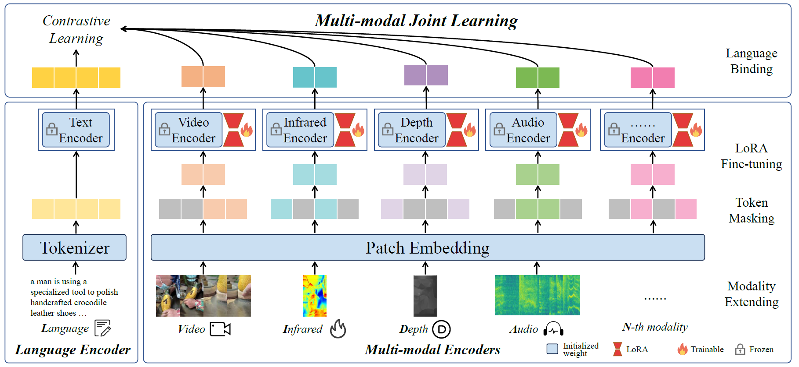
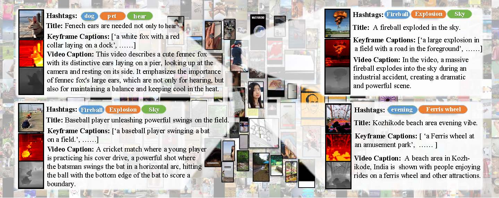
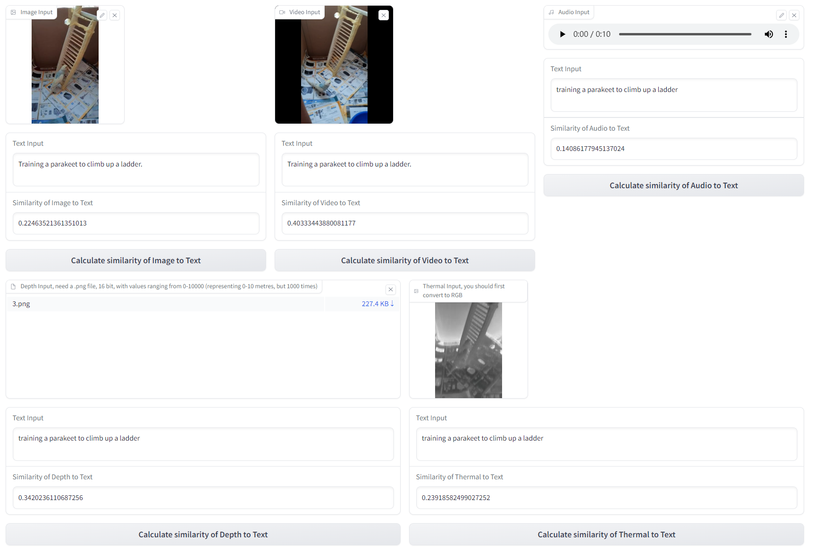
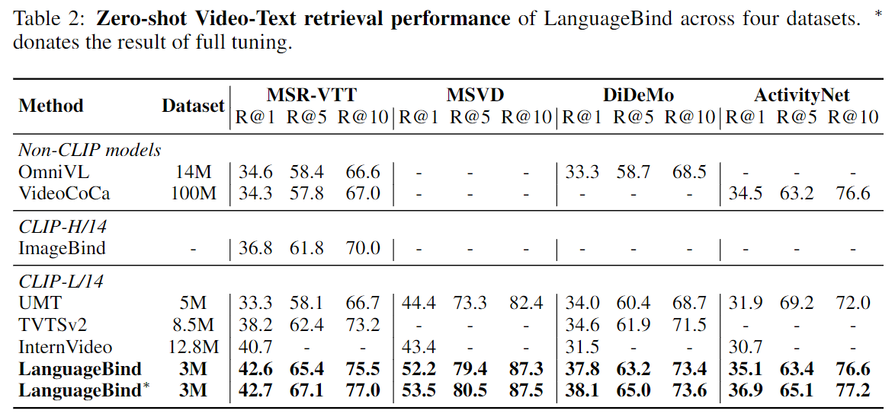

<p align="center">
    
<p>
<h2 align="center"> <a href="https://arxiv.org/pdf/2310.01852.pdf">LanguageBind: Extending Video-Language Pretraining to N-modality by Language-based Semantic Alignment</a></h2>
<h5 align="center"> If you like our project, please give us a star ⭐ on GitHub for latest update.  </h2>

<!--
<p align="center">
📖 <a href="https://arxiv.org/pdf/2310.01852.pdf">Paper</a>
    &nbsp｜&nbsp
🤗<a href="https://huggingface.co/spaces/LanguageBind/LanguageBind">Demo</a>
    &nbsp&nbsp|&nbsp&nbsp
🤖 <a href="https://github.com/PKU-YuanGroup/LanguageBind/tree/main#-api">API</a>
    &nbsp&nbsp|&nbsp&nbsp
📄<a href="https://github.com/PKU-YuanGroup/LanguageBind#%EF%B8%8F-training--validating">Instruction</a>
    &nbsp｜
💥<a href="https://github.com/PKU-YuanGroup/LanguageBind#-vidal-10m">Datasets</a>
</p>
-->

[](https://huggingface.co/spaces/LanguageBind/LanguageBind)
[](https://arxiv.org/abs/2310.01852)
[](https://zhuanlan.zhihu.com/p/660567767)


[](https://hits.seeyoufarm.com) <br>
[]()
[]()  <br>


[](https://paperswithcode.com/sota/zero-shot-scene-classification-unified?p=languagebind-extending-video-language) <br>
[](https://paperswithcode.com/sota/zero-shot-classification-unified-classes-on?p=languagebind-extending-video-language) <br>
[](https://paperswithcode.com/sota/zero-shot-environment-sound-classification-on-1?p=languagebind-extending-video-language) <br>
[](https://paperswithcode.com/sota/zero-shot-text-to-audio-retrieval-on-clotho?p=languagebind-extending-video-language) <br>
[](https://paperswithcode.com/sota/zero-shot-video-retrieval-on-msvd?p=languagebind-extending-video-language) <br>
[](https://paperswithcode.com/sota/zero-shot-video-retrieval-on-msr-vtt?p=languagebind-extending-video-language) <br>
[](https://paperswithcode.com/sota/zero-shot-video-retrieval-on-activitynet?p=languagebind-extending-video-language) <br>
[](https://paperswithcode.com/sota/zero-shot-video-retrieval-on-didemo?p=languagebind-extending-video-language) <br>
[](https://paperswithcode.com/sota/zero-shot-action-recognition-on-kinetics?p=languagebind-extending-video-language) 


## 📰 News
* **[2023.10.14]**  😱 LanguageBind-Video achieves **state-of-the-art (SOTA) performance on 4 datasets**, checking our ✨[results](#video-language)! The checkpoint **have updated** on Huggingface Model Hub!
* **[2023.10.12]**  👀 We are training a **stronger LanguageBind-Video** model. The checkpoint will also be updated on Huggingface Model Hub soon.
* **[2023.10.10]**  🎉 We updated the **LanguageBind-Audio** to exceed ImageBind by **16.2%** on the ESC-50 dataset. Sample data can be found in [assets](assets), and [emergency zero-shot usage](#emergency-zero-shot) is described. 
* **[2023.10.07]**  The checkpoints are available on 🤗 [Huggingface Model](https://huggingface.co/LanguageBind).
* **[2023.10.04]**  Code and [demo](https://huggingface.co/spaces/LanguageBind/LanguageBind) are available now! Welcome to **watch** 👀 this repository for the latest updates.

## 😮 Highlights

### 💡 High performance, but NO intermediate modality required
LanguageBind is a **language-centric** multimodal pretraining approach, **taking the language as the bind across different modalities** because the language modality is well-explored and contains rich semantics. 
* The following first figure shows the architecture of LanguageBind. LanguageBind can be easily extended to segmentation, detection tasks, and potentially to unlimited modalities. 

### ⚡️ A multimodal, fully aligned and voluminous dataset
We propose **VIDAL-10M**, **10 Million data** with **V**ideo, **I**nfrared, **D**epth, **A**udio and their corresponding **L**anguage, which greatly expands the data beyond visual modalities.
* The second figure shows our proposed VIDAL-10M dataset, which includes five modalities: video, infrared, depth, audio, and language.

### 🔥 Multi-view enhanced description for training
We make multi-view enhancements to language. We produce multi-view description that combines **meta-data**, **spatial**, and **temporal** to greatly enhance the semantic information of the language. In addition we further **enhance the language with ChatGPT** to create a good semantic space for each modality aligned language.

<p align="center">

</p>
<p align="center">

</p>

## 🤗 Demo

* **Local demo.** Highly recommend trying out our web demo, which incorporates all features currently supported by LanguageBind.
```bash
python gradio_app.py
```

* **Online demo.** We provide the [online demo](https://huggingface.co/spaces/LanguageBind/LanguageBind) in Huggingface Spaces. In this demo, you can calculate the similarity of modalities to language, such as audio-to-language, video-to-language, and depth-to-image.
<p align="center">

</p>


## 🚀 Main Results

### Video-Language
LanguageBind achieves **state-of-the-art (SOTA) performance on four datasets**, surpassing InterVideo by 1.9% on MSR-VTT, 8.8% on MSVD, 6.3% on DiDeMo, and 4.4% on ActivityNet. It is worth noting that InterVideo employs more extensive training data, signifying that LanguageBind represents an efficient pretraining method.
<p align="center">

</p>

### Multiple Modalities
Video-Language, Infrared-Language, Depth-Language, and Audio-Language zero-shot classification. We report text-to-audio R@1 for the Clotho dataset and top-1 accuracy for the rest of the datasets.
<p align="center">

</p>

## 🛠️ Requirements and Installation
* Python >= 3.8
* Pytorch >= 1.13.1
* CUDA Version >= 11.6
* Install required packages:
```bash
git clone https://github.com/PKU-YuanGroup/LanguageBind
cd LanguageBind
pip install torch==1.13.1+cu116 torchvision==0.14.1+cu116 torchaudio==0.13.1 --extra-index-url https://download.pytorch.org/whl/cu116
pip install -r requirements.txt
```

## 🤖 API
**We open source all modalities preprocessing code.** If you want to load the model (e.g. ```LanguageBind/LanguageBind_Thermal```) from the model hub on Huggingface or on local, you can use the following code snippets.

### Inference for Multi-modal Binding 
We have provided some sample datasets in [assets](assets) to quickly see how languagebind works.
```python
import torch
from languagebind import LanguageBind, to_device, transform_dict, LanguageBindImageTokenizer

if __name__ == '__main__':
    device = 'cuda:0' if torch.cuda.is_available() else 'cpu'
    device = torch.device(device)
    clip_type = ('thermal', 'image', 'video', 'depth', 'audio')
    model = LanguageBind(clip_type=clip_type, cache_dir='./cache_dir')
    model = model.to(device)
    model.eval()
    pretrained_ckpt = f'LanguageBind/LanguageBind_Image'
    tokenizer = LanguageBindImageTokenizer.from_pretrained(pretrained_ckpt, cache_dir='./cache_dir/tokenizer_cache_dir')
    modality_transform = {c: transform_dict[c](model.modality_config[c]) for c in clip_type}

    image = ['assets/image/0.jpg', 'assets/image/1.jpg']
    audio = ['assets/audio/0.wav', 'assets/audio/1.wav']
    video = ['assets/video/0.mp4', 'assets/video/1.mp4']
    depth = ['assets/depth/0.png', 'assets/depth/1.png']
    thermal = ['assets/thermal/0.jpg', 'assets/thermal/1.jpg']
    language = ["Training a parakeet to climb up a ladder.", 'A lion climbing a tree to catch a monkey.']

    inputs = {
        'image': to_device(modality_transform['image'](image), device),
        'video': to_device(modality_transform['video'](video), device),
        'audio': to_device(modality_transform['audio'](audio), device),
        'depth': to_device(modality_transform['depth'](depth), device),
        'thermal': to_device(modality_transform['thermal'](thermal), device),
    }
    inputs['language'] = to_device(tokenizer(language, max_length=77, padding='max_length',
                                             truncation=True, return_tensors='pt'), device)
    with torch.no_grad():
        embeddings = model(inputs)
    print("Video x Text: \n",
          torch.softmax(embeddings['video'] @ embeddings['language'].T, dim=-1).detach().cpu().numpy())
    print("Image x Text: \n",
          torch.softmax(embeddings['image'] @ embeddings['language'].T, dim=-1).detach().cpu().numpy())
    print("Depth x Text: \n",
          torch.softmax(embeddings['depth'] @ embeddings['language'].T, dim=-1).detach().cpu().numpy())
    print("Audio x Text: \n",
          torch.softmax(embeddings['audio'] @ embeddings['language'].T, dim=-1).detach().cpu().numpy())
    print("Thermal x Text: \n",
          torch.softmax(embeddings['thermal'] @ embeddings['language'].T, dim=-1).detach().cpu().numpy())
```
Then returns the following result.
```bash
Video x Text: 
 [[9.9999988e-01 1.5560659e-07]
 [6.2432008e-08 9.9999988e-01]]
Image x Text: 
 [[1.0000000e+00 4.0599781e-09]
 [1.2165208e-08 1.0000000e+00]]
Depth x Text: 
 [[9.9952829e-01 4.7178473e-04]
 [1.6411507e-01 8.3588487e-01]]
Audio x Text: 
 [[0.9977429  0.00225709]
 [0.00996918 0.99003077]]
Thermal x Text: 
 [[0.9744922  0.02550781]
 [0.3656127  0.6343873 ]]
```
### Emergency zero-shot
Since languagebind binds each modality together, we also found the **emergency zero-shot**. It's very simple to use.
```python
print("Video x Audio: \n", torch.softmax(embeddings['video'] @ embeddings['audio'].T, dim=-1).detach().cpu().numpy())
print("Image x Depth: \n", torch.softmax(embeddings['image'] @ embeddings['depth'].T, dim=-1).detach().cpu().numpy())
print("Image x Thermal: \n", torch.softmax(embeddings['image'] @ embeddings['thermal'].T, dim=-1).detach().cpu().numpy())
```
Then, you will get:
```
Video x Audio: 
 [[1. 0.]
 [0. 1.]]
Image x Depth: 
 [[1. 0.]
 [0. 1.]]
Image x Thermal: 
 [[1. 0.]
 [0. 1.]]
 ```

### Different branches for X-Language task
Additionally, LanguageBind can be **disassembled into different branches** to handle different tasks. Note that we do not train Image, which just initialize from OpenCLIP.
#### Thermal
```python
import torch
from languagebind import LanguageBindThermal, LanguageBindThermalTokenizer, LanguageBindThermalProcessor

pretrained_ckpt = 'LanguageBind/LanguageBind_Thermal'
model = LanguageBindThermal.from_pretrained(pretrained_ckpt, cache_dir='./languagebind/cache_dir')
tokenizer = LanguageBindThermalTokenizer.from_pretrained(pretrained_ckpt, cache_dir='./languagebind/cache_dir')
thermal_process = LanguageBindThermalProcessor(model.config, tokenizer)

model.eval()
data = thermal_process([r"your/thermal.jpg"], ['your text'], return_tensors='pt')
with torch.no_grad():
    out = model(**data)

print(out.text_embeds @ out.image_embeds.T)
```

#### Depth
```python
import torch
from languagebind import LanguageBindDepth, LanguageBindDepthTokenizer, LanguageBindDepthProcessor

pretrained_ckpt = 'LanguageBind/LanguageBind_Depth'
model = LanguageBindDepth.from_pretrained(pretrained_ckpt, cache_dir='./languagebind/cache_dir')
tokenizer = LanguageBindDepthTokenizer.from_pretrained(pretrained_ckpt, cache_dir='./languagebind/cache_dir')
depth_process = LanguageBindDepthProcessor(model.config, tokenizer)

model.eval()
data = depth_process([r"your/depth.png"], ['your text.'], return_tensors='pt')
with torch.no_grad():
    out = model(**data)

print(out.text_embeds @ out.image_embeds.T)
```

#### Video
```python
import torch
from languagebind import LanguageBindVideo, LanguageBindVideoTokenizer, LanguageBindVideoProcessor

pretrained_ckpt = 'LanguageBind/LanguageBind_Video'
model = LanguageBindVideo.from_pretrained(pretrained_ckpt, cache_dir='./languagebind/cache_dir')
tokenizer = LanguageBindVideoTokenizer.from_pretrained(pretrained_ckpt, cache_dir='./languagebind/cache_dir')
video_process = LanguageBindVideoProcessor(model.config, tokenizer)

model.eval()
data = video_process(["your/video.mp4"], ['your text.'], return_tensors='pt')
with torch.no_grad():
    out = model(**data)

print(out.text_embeds @ out.image_embeds.T)
```

#### Audio
```python
import torch
from languagebind import LanguageBindAudio, LanguageBindAudioTokenizer, LanguageBindAudioProcessor

pretrained_ckpt = 'LanguageBind/LanguageBind_Audio'
model = LanguageBindAudio.from_pretrained(pretrained_ckpt, cache_dir='./languagebind/cache_dir')
tokenizer = LanguageBindAudioTokenizer.from_pretrained(pretrained_ckpt, cache_dir='./languagebind/cache_dir')
audio_process = LanguageBindAudioProcessor(model.config, tokenizer)

model.eval()
data = audio_process([r"your/audio.wav"], ['your audio.'], return_tensors='pt')
with torch.no_grad():
    out = model(**data)

print(out.text_embeds @ out.image_embeds.T)
```

#### Image
Note that our image encoder is the same as OpenCLIP. **Not** as fine-tuned as other modalities.
```python
import torch
from languagebind import LanguageBindImage,  LanguageBindImageTokenizer,  LanguageBindImageProcessor

pretrained_ckpt = 'LanguageBind/LanguageBind_Image'
model = LanguageBindImage.from_pretrained(pretrained_ckpt, cache_dir='./languagebind/cache_dir')
tokenizer = LanguageBindImageTokenizer.from_pretrained(pretrained_ckpt, cache_dir='./languagebind/cache_dir')
image_process = LanguageBindImageProcessor(model.config, tokenizer)

model.eval()
data = image_process([r"your/image.jpg"], ['your text.'], return_tensors='pt')
with torch.no_grad():
    out = model(**data)

print(out.text_embeds @ out.image_embeds.T)
```

## 💥 VIDAL-10M
The datasets is in [DATASETS.md](DATASETS.md).

## 🗝️ Training & Validating
The training & validating instruction is in [TRAIN_AND_VALIDATE.md](TRAIN_AND_VALIDATE.md).

## 👍 Acknowledgement
* [OpenCLIP](https://github.com/mlfoundations/open_clip) An open source pretraining framework.
* [CLIP4Clip](https://github.com/ArrowLuo/CLIP4Clip) An open source Video-Text retrieval framework.
* [sRGB-TIR](https://github.com/rpmsnu/sRGB-TIR) An open source framework to generate infrared (thermal) images.
* [GLPN](https://github.com/vinvino02/GLPDepth) An open source framework to generate depth images.

## 🔒 License
* The majority of this project is released under the MIT license as found in the [LICENSE](https://github.com/PKU-YuanGroup/LanguageBind/blob/main/LICENSE) file.
* The dataset of this project is released under the CC-BY-NC 4.0 license as found in the [DATASET_LICENSE](https://github.com/PKU-YuanGroup/LanguageBind/blob/main/DATASET_LICENSE) file. 

## ✏️ Citation
If you find our paper and code useful in your research, please consider giving a star :star: and citation :pencil:.

```BibTeX
@misc{zhu2023languagebind,
      title={LanguageBind: Extending Video-Language Pretraining to N-modality by Language-based Semantic Alignment}, 
      author={Bin Zhu and Bin Lin and Munan Ning and Yang Yan and Jiaxi Cui and Wang HongFa and Yatian Pang and Wenhao Jiang and Junwu Zhang and Zongwei Li and Cai Wan Zhang and Zhifeng Li and Wei Liu and Li Yuan},
      year={2023},
      eprint={2310.01852},
      archivePrefix={arXiv},
      primaryClass={cs.CV}
}
```


## ✨ Star History

[](https://star-history.com/#PKU-YuanGroup/LanguageBind&Date)
